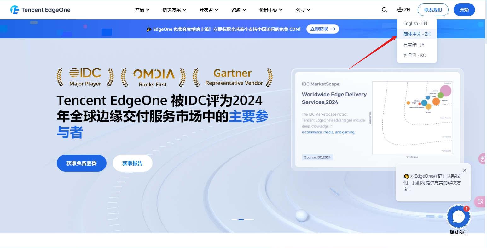
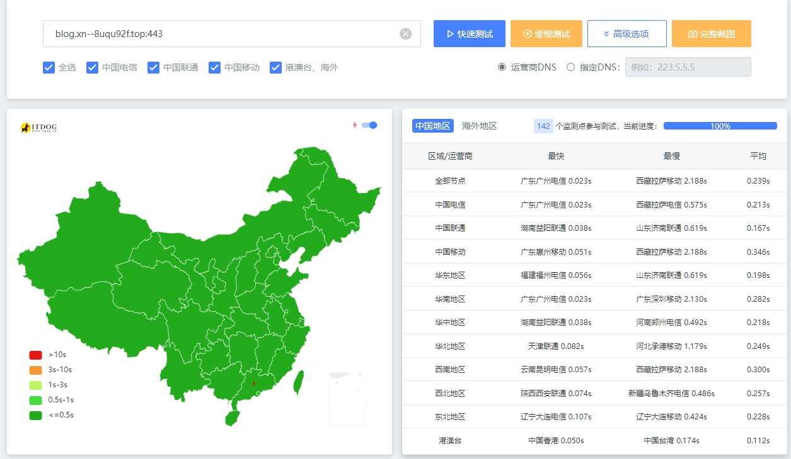
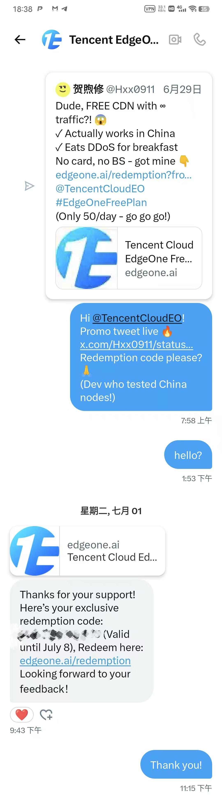

# 前言

最近腾讯出了个 EdgeOne 的免费 CDN 套餐，我也是直接薅上了！现在我这个博客用的就是它加速，速度简直是“nice”到飞起！🙈 看这速度，简直不要太爽！

# 准备工作

我们所需要的东西只有这些： 1.一个可以正常使用的邮箱 2.一个测速用的工具，例如[ITDOG](https://www.itdog.cn/)，用来优选ip和对比网站访问速度。**注意**：如果开启ssl，请测试443端口，例如blog.xn--8uqu92f.top:443 。不过不需要担心浏览器访问，EO会自动重定向。 3.外币卡:YPT,Bybiy，Pokepay都可以用(为啥推荐，通过优惠码，都可以免费开卡使用）通过它们，我们就可以过3DM验证了（后续自动续签ssl用的到） 4.一个域名，二级域名不支持哦🙃

# 第一步：申请（二选一）

## 免费申请（需要等待一定时间）

### 方式1：发推到X（推荐）

我们只需要去[EdgeOne 国际站](https://edgeone.ai/zh/redemption)（有备案的国内站更快哦，方法一样），三选一进行申请即可。 我是通过用Gemini生成了一篇推(中文推文好像也行)。然后等了3天就有了，发完推，不妨主动去 TencentCloudEO 的账号私信一下，说不定还能加速进程呢。。 

### 方式2：加入EO的 Discord 服务器抢码（没有试）

如果你自认反应够快，可以试试。否则…还是算了吧。。。╮(╯▽╰)╭

### 方式3：在你的GitHub上的项目里打广告

这个方式虽然“有机会”拿到兑换码，但感觉有点像在为爱发电（免费帮忙打广告，没报酬），总觉得不够划算，还是 skip 掉罢！(╯°A°)╯︵○○○

## 付费申请（无需等待）

如果你等不及了，那就直接买一个月的个人版套餐吧，才 9.9 元！ **重要提示**： 记得取消“自动续费”哦，不然钱包会哭泣的！😀 为了避免账户被“薅羊毛”，有个小技巧：设置用量封顶策略。这样套餐到期后它就会乖乖变成免费版了 😜 然后，你需要做一些必要的闲置防止被反薅，在用量封顶策略里进行限制 最后等它自动过期，降为免费版即可😜

# 第二步：把你的网站挂上EO

1.注册不需要多说了吧，不会的话建议自己去B站查吧 2.添加站点，输入你的域名，选择加速区域全球可用区（不含中国大陆），和CNAME验证，**重要**，这样才可以优选，然后添加域名，别的自定义或者默认都可以，不过需要在回源配置输入你服务器的ip或者域名（A记录或者别的），如果你使用了 Cloudflare，那么回源 HOST 头是需要更改的，如果报错427了，改为使用源站域名即可 最后等待部署完成就可以了（如果网站打不开是 403，那多半是 SSL 证书的问题。去 EdgeOne 申请个免费证书就 OK 了！） 3.进行优选ip（可能会导致封号，权衡利弊使用），在你的dns记录里指定使用什么ip，可以使用指定ip，例如本站是使用43.174.150.150 ，你也可以使用加速域名，用加速域名也可以，但我测下来还是直接指定 IP 更快！ 具体就是把前面的CNAME改为你需要的地址即可

# 搞定收工！

这样一来，EdgeOne 的免费 CDN 就基本配置好了！至于 SSL 自动续签，我下篇再详细展开讲哈！