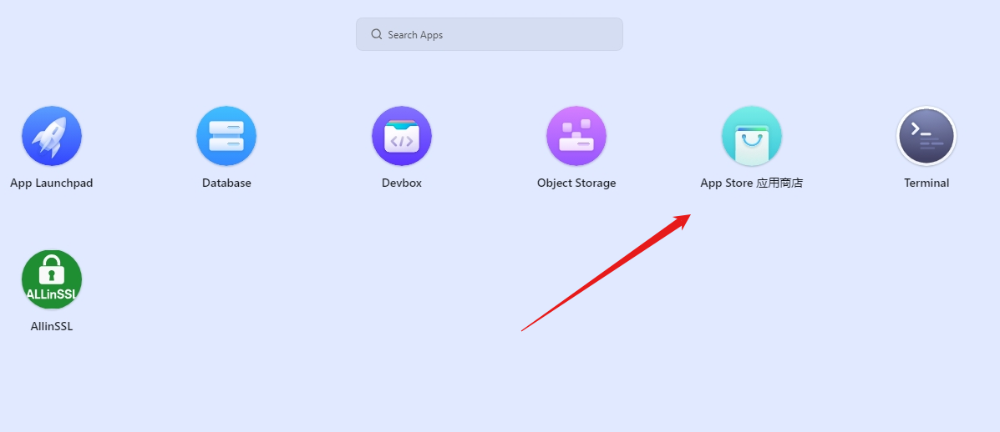
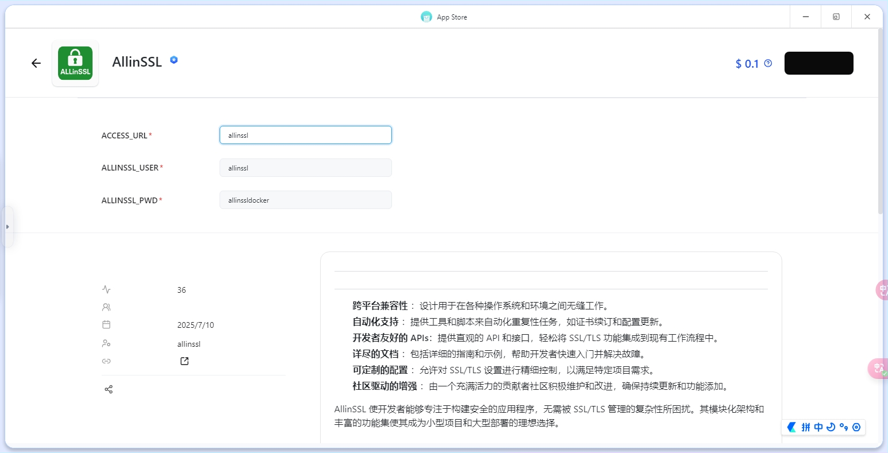
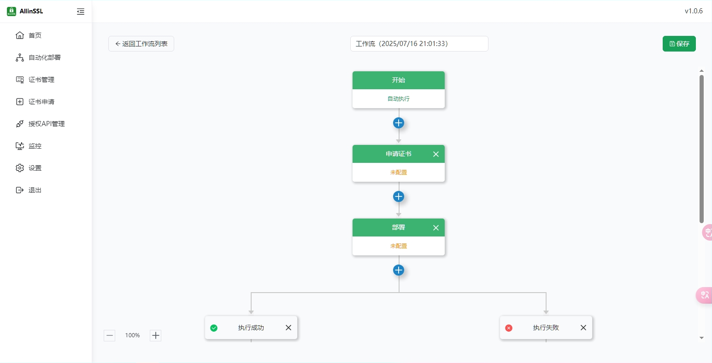

# 开篇闲聊

在上一篇文章，我们成功的使用EO加速了网站，这 EdgeOne的速度是真香，但那个 SSL 证书就有点“不省心”了。你说这腾讯吧，就不能学学 Cloudflare 吗？人家 CF 免费续个十年八载的，我这边还得自己操心，真是让人又爱又“恨”！ 老话说的好，自己动手丰衣足食。那么这篇文章我们便通过在[**ClawCloud**](https://console.run.claw.cloud/signin) 免费部署docker容器（Github注册满180天用户就可以每月获得5刀来玩），部署AllinSSL，对接dns提供商和腾讯云，来自动续签ssl

# 手动续签 SSL？不可能的事！🖕

## 注册账号

首先我们需要注册一个爪云（[**ClawCloud**](https://console.run.claw.cloud/signin)）的账号，建议使用注册满180天的Github号来注册。

## 部署AllinSSL

注册完成后，点击应用商店，如图  
然后找到AllinSSL，首页就有，很好找，第二行就是 
部署，这里有三个参数，第一个是安全入口。相信使用过Linux面板的朋友都知道这是干什么的，这里就不多bb（但是你要么不修改，要么得自己记住了）。第二个是用户名，第三个是密码，自己记住即可。
部署完成后，登录AllinSSL，添加自动化部署。

按照上面的一步步填写（懒得截图了，自己摸索吧），需要提醒的是**证书**选择**Let's Encrypt**（免费），**部署**选择腾讯云EdgeOne（自定义ssl需要3DM验证，不会扣钱的放心吧），**DNS提供商**按照[官方文档](https://allinssl.com/guide/help/provider/)填写，提个醒，Cloudflare 是需要Global API Key的，别搞错了。

# 最终完成

这样你的EdgeOne就完整了，快去享受吧